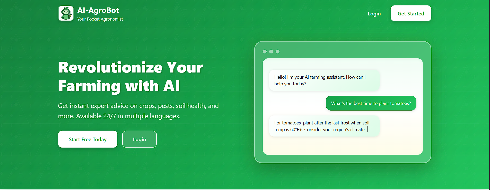
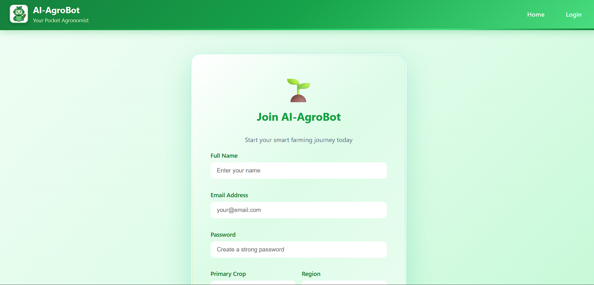
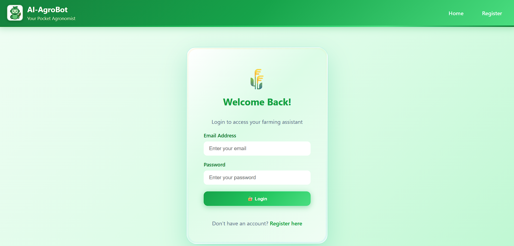

# AI-AgroBot

**An intelligent agricultural chatbot powered by AI to assist farmers with crop management, pest control, soil health, and farming recommendations.**

## About

AI-AgroBot is a Flask-based web application that provides:
- AI-powered farming advice using OpenAI GPT
- Multi-language support (English, Hindi, Tamil, etc.)
- Image analysis for crop/pest identification
- Voice input for queries
- Chat history tracking
- User profiles with personalized recommendations
- Admin dashboard for user management

## Tech Stack

- **Backend**: Python, Flask, SQLAlchemy
- **Frontend**: HTML, CSS, JavaScript
- **Database**: SQLite
- **AI**: OpenAI API, LangDetect, GoogleTrans
- **Security**: Flask-Login, Werkzeug

## Architecture

The application follows a traditional MVC (Model-View-Controller) architecture:

```
┌─────────────┐
│   Browser   │
│  (Client)   │
└──────┬──────┘
       │ HTTP Requests
       ▼
┌─────────────────────────────┐
│      Flask Server           │
│  ┌─────────────────────┐   │
│  │   Routes (app.py)   │   │
│  └──────────┬──────────┘   │
│             │               │
│  ┌──────────▼──────────┐   │
│  │  Chatbot Model      │◄──┼─── OpenAI API
│  │ (chatbot_model.py)  │   │
│  └──────────┬──────────┘   │
│             │               │
│  ┌──────────▼──────────┐   │
│  │   Database Layer    │   │
│  │   (database.py)     │   │
│  └──────────┬──────────┘   │
│             │               │
│  ┌──────────▼──────────┐   │
│  │   SQLite Database   │   │
│  │   (instance/site.db)│   │
│  └─────────────────────┘   │
└─────────────────────────────┘
       │
       ▼ Knowledge Base
┌─────────────────┐
│  kb.json        │
│  kb_*.csv files │
└─────────────────┘
```

## Project Structure

```
AI-AgroBot/
│
├── app.py                          # Main Flask application & routes
├── chatbot_model.py                # AI chatbot logic & NLP processing
├── database.py                     # Database models (User, ChatHistory)
├── requirements.txt                # Python dependencies
├── README.md                       # Project documentation
├── CONFIG.md                       # Configuration guide
├── QUICKSTART.md                   # Quick start guide
├── docker-compose.yml              # Docker compose configuration
├── Dockerfile.txt                  # Docker container setup
│
├── kb.json                         # Knowledge base (JSON format)
├── kb_agriculture_master.csv       # Main agricultural knowledge base
├── kb_full_professional.csv        # Professional farming knowledge
├── kb_fruits_veggies_extended.csv  # Fruits & vegetables data
│
├── instance/                       # Database files
│   └── site.db                     # SQLite database
│
├── templates/                      # HTML templates (Jinja2)
│   ├── base.html                   # Base template with navbar
│   ├── landing.html                # Landing/home page
│   ├── login.html                  # User login page
│   ├── register.html               # User registration page
│   ├── index.html                  # Main chat interface
│   ├── profile.html                # User profile management
│   ├── admin_dashboard.html        # Admin panel
│   └── admin_view_user.html        # User details (admin view)
│
├── static/                         # Static assets
│   ├── style.css                   # Main stylesheet
│   ├── script.js                   # JavaScript for chat functionality
│   ├── bot.png                     # Bot logo/icon
│   └── favicon.ico                 # Website favicon
│
├── utils/                          # Utility modules
│   └── safety.py                   # Content filtering & safety checks
│
├── uploads/                        # User uploaded files
│   ├── kb_agriculture_master.csv
│   ├── kb_fruits_veggies_extended.csv
│   └── kb_full_professional.csv
│
├── screenshots/                    # Application screenshots
│   └── README.md
│
└── __pycache__/                    # Python cache files
```

### Key Files Explained

- **app.py**: Main Flask application containing all routes (login, register, chat, admin panel, etc.)
- **chatbot_model.py**: Handles AI processing, language detection, translation, and OpenAI integration
- **database.py**: SQLAlchemy models for User and ChatHistory tables
- **templates/**: HTML files using Jinja2 templating for dynamic content
- **static/**: CSS, JavaScript, and images for frontend
- **utils/safety.py**: Content moderation and safety filters
- **kb files**: Agricultural knowledge base in CSV and JSON formats

## Installation

### Prerequisites
- Python 3.8+
- OpenAI API Key

### Setup Steps

1. **Clone the repository**
```bash
git clone https://github.com/Sharan3321/AI-AgroBot.git
cd AI-AgroBot
```

2. **Create virtual environment**
```bash
python -m venv venv
venv\Scripts\activate
```

3. **Install dependencies**
```bash
pip install -r requirements.txt
```

4. **Set environment variables**
Create a `.env` file:
```env
FLASK_SECRET_KEY=your_secret_key_here
OPENAI_API_KEY=your_openai_api_key_here
```

5. **Initialize database**
```bash
python
>>> from app import app, db
>>> with app.app_context():
...     db.create_all()
>>> exit()
```

## How to Run

1. **Activate virtual environment**
```bash
venv\Scripts\activate
```

2. **Run the application**
```bash
python app.py
```

3. **Open browser**
Navigate to `http://localhost:5000`

## Default Admin Login
- Email: `admin@agro.com`
- Password: `admin123`

## Screenshots

### 1. Landing Page

*Welcome page with feature highlights and call-to-action buttons*

### 2. User Registration

*New user registration with farming profile setup*

### 3. Login Page

*Secure user authentication*

### 4. Chatbot Interface

*Main chatbot interface with AI-powered farming advice and multi-language support*

### 5. Admin Dashboard

*Admin panel for user management and analytics*

### 6. Admin Dashboard - Detailed View

*Comprehensive admin view with user statistics and management*

## Features

✅ AI-powered agricultural advice  
✅ Multi-language support (English, Hindi, Tamil)  
✅ User authentication & profiles  
✅ Chat history tracking  
✅ Admin dashboard with analytics  
✅ Knowledge base with 1000+ farming topics  
✅ Responsive design  
✅ Secure password hashing  
✅ Voice input support  
✅ Image analysis capabilities  

## Contributing

Contributions are welcome! Please feel free to submit a Pull Request.
